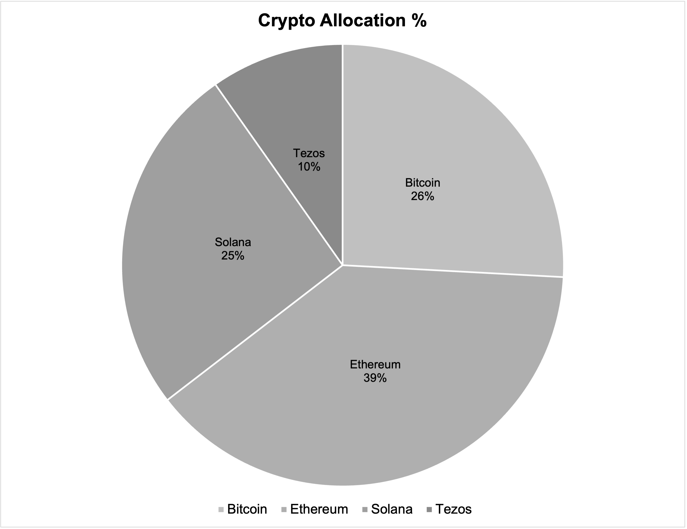
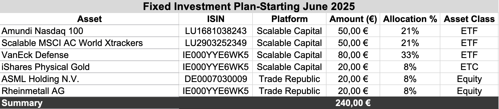
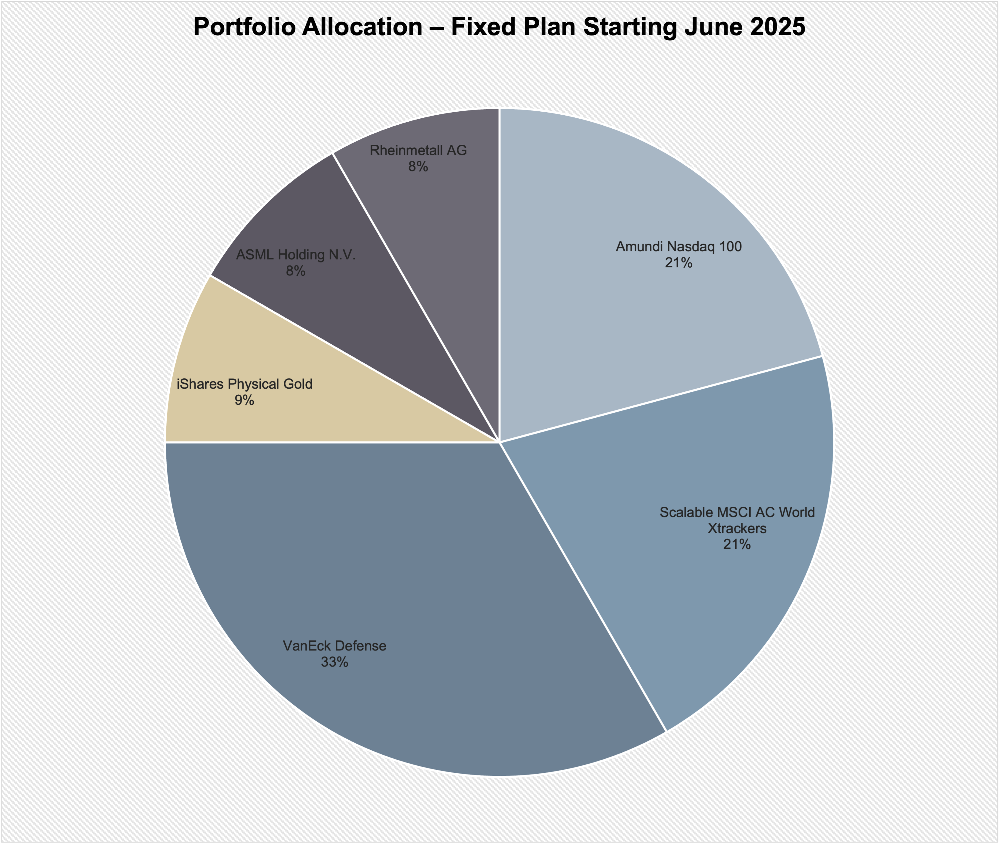
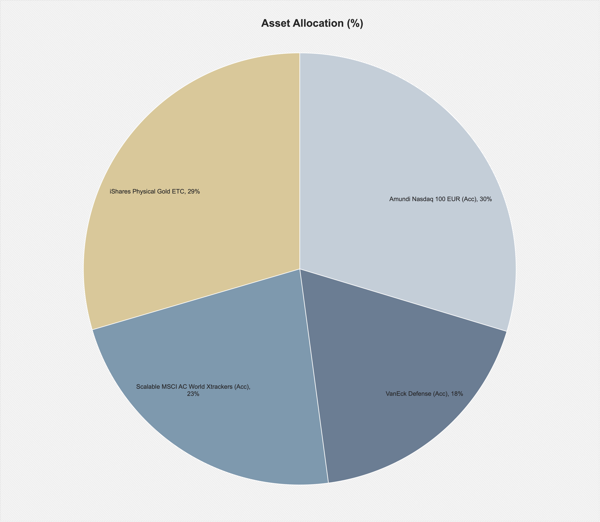
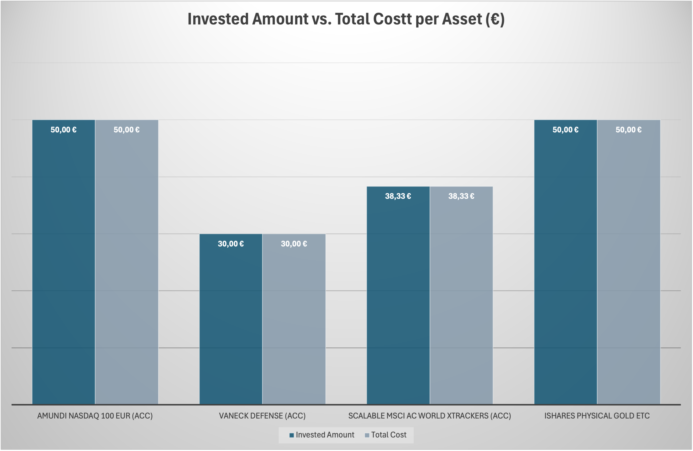
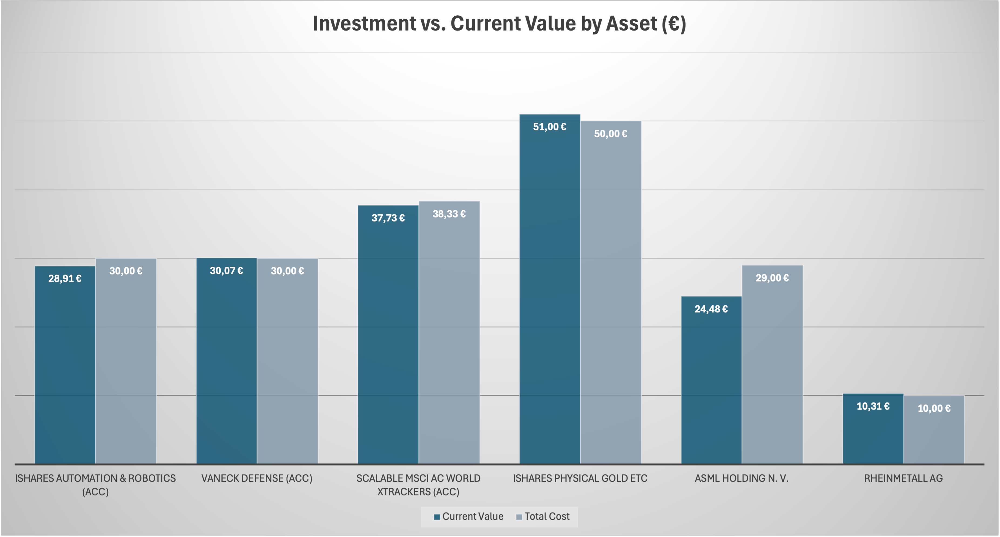

# Persönliches Finanz und Lernprojekt Mai 2025

👉 For the full English version of the technical project overview, please switch to the [README_en.md](./README_en.md)  
**Crypto | ETFs | Digitale Kunst | Analysen und Diagramme**

---

## Hinweis für Fachleute und Dateninteressierte

Dieses Projekt enthält bewusst erzählerische Abschnitte, die den persönlichen Hintergrund dokumentieren. Wer sich ausschließlich für die technische Struktur interessiert, findet in der separaten Datei `README_technical.md` eine sachliche Übersicht über Datenquellen, Methoden, Werkzeuge und geplante Analysen.

Einige Inhalte wurden gezielt veröffentlicht. Andere, vor allem sensible oder private Informationen, bleiben aus Gründen des Datenschutzes im nicht öffentlichen Bereich.

---

## Zielsetzung

Dieses Projekt ist mein persönlicher Einstieg in die Welt von Finanzen, Daten und digitaler Identität. Ich beginne nicht als Experte, sondern als Lernender mit dem Ziel zu verstehen, wie Geld, Investitionen und Datenanalysen funktionieren.

---

## Beweggründe

Ich wollte nicht warten, bis ich perfekt vorbereitet bin. Stattdessen habe ich mit kleinen Beträgen begonnen, um durch echtes Handeln zu lernen.

> *Ich bin überzeugt: Lernen passiert nur durch Tun.*

Anstatt ein abstraktes Projekt über fremde Unternehmensdaten zu machen, nutze ich meine eigenen Daten:

- Investitionen  
- Wallets  
- Verluste und Gewinne  
- Rewards  
- Kaufverhalten  
- Rückschlüsse aus realen Entwicklungen

Ich finanziere dieses Projekt mit Geld, das ich bei meiner Ankunft in Deutschland mitgebracht habe. Ein Teil war ein Geschenk von Familie und Freundinnen und Freunden, ein anderer Teil stammt aus eigenen Mitteln.

Das Kapital blieb viele Jahre unberührt, weil ich in einem System lebte, in dem persönlicher Besitz nicht vorgesehen war. Erst im Mai 2025 habe ich entschieden, es selbstbestimmt einzusetzen.

---

## Persönlicher Hintergrund

Ich bin 37 Jahre alt, habe Geschichte und Kulturwissenschaften studiert und lebe in Berlin. Aktuell bin ich noch Mitglied eines katholischen Ordens mit stabiler Absicherung, aber ohne finanzielle Eigenständigkeit.

Ich bin hochsensibel. Diese Eigenschaft habe ich erst vor Kurzem angenommen. Seitdem hat sich meine Lebensqualität deutlich verbessert. Ich verstehe besser, was ich brauche, wie ich arbeite und was mir guttut.

Wenn es um Fakten, Zahlen und Systeme geht, bin ich sehr direkt. Ich beschönige nichts. Ich nenne Dinge beim Namen. Das zeigt sich auch in diesem Projekt.

---

## Über Krypto, Plattformen und Community

Ich investiere mit kleinen Beträgen in vier Coins, die ich langfristig halten möchte: **BTC, ETH, SOL, XTZ**

Sie bieten mir:

- klare Zahlen  
- unterschiedliche Anwendungsbereiche  
- Rewards und Staking  
- offene, kreative Communitys  
- Verbindung von Technologie, Identität und Kunst

Ich nutze Plattformen wie Bitvavo, Temple, Phantom, MetaMask und bald auch Ledger.

NFTs sind für mich keine Spekulation, sondern Ausdruck digitaler Identität. Sie stehen gleichwertig neben klassischen Investments.

Ich bleibe realistisch. Zusätzlich zu Krypto und NFTs investiere ich regelmäßig in ETFs und Aktien, um finanzielle Sicherheit aufzubauen.

---

## Über das Lernen mit Geld

Ich lerne durch Fehler. Anfangs habe ich ungeeignete ETFs gekauft und später verkauft. Jetzt habe ich ein kleines, strukturiertes Kernportfolio.

Ich habe gelernt:

- wie Gebühren die Rendite beeinflussen  
- wie wichtig Übersicht und Planung sind  
- wie ich auch mit wenig Geld systematisch sparen kann

**Mein Ziel ist kein perfektes Portfolio, sondern ein Raum zum Verstehen.**

---

## Und jetzt?

Ich bin am Anfang. Mein Ziel ist es, mit echten Daten, klarer Struktur und sinnvoller Dokumentation zu lernen.

Dieses Projekt wächst mit mir. Es ist nicht perfekt, aber konsequent aufgebaut.

---

## Ein persönlicher Hinweis

Ich dachte lange, Persönliches habe keinen Platz in einem Projekt wie diesem. Heute sehe ich das anders.

In einer Zeit, in der queere Menschen vermehrt Angriffen ausgesetzt sind, ist Sichtbarkeit auch Verantwortung.  
Ich bin kein Aktivist, sondern ein Mensch, der in Ruhe leben und arbeiten möchte. Genau deshalb gehört meine Geschichte in dieses Projekt. Ehrlich, ruhig, auf meine Weise.

**Dieses Projekt ist auch ein Schritt zurück ins Leben.**

---

## Technischer Projektüberblick – Stand: 25. Mai 2025
Letzte Aktualisierung: 3. Juni 2025

Dieser Abschnitt ergänzt den persönlichen Teil des Projekts um eine sachliche und strukturierte Übersicht aller verwendeten Datenquellen, Methoden, Tools und geplanten Schritte.

**Hinweis:**  
Die Excel-Dateien werden monatlich veröffentlicht und befinden sich am Ende des README – nach der Zielsetzung.  
Alle Daten, Diagramme und Excel-Dateien werden jeweils zu Beginn eines Monats aktualisiert.

---

 ## Technischer Umgang mit Daten

- **Daten-Erfassung:** Manuelle Eingabe von Investitionen, Preisen und Käufen in Excel  
- **Daten-Speicherung:** Lokale Speicherung auf meinem MacBook + Cloud-Backup  
- **Daten-Pflege:** Wöchentliche Preisaktualisierung, monatliche neue Einträge  
- **Daten-Analyse:** Berechnungen, Visualisierungen (z. B. Portfolio-Anteile, Gewinnentwicklung)  
- **Teilweise Verarbeitung mit Python:** Erste Tests zur Automatisierung und späteren Analyse (z. B. Diagramme, Datenbereinigung)  
- **Daten-Veröffentlichung:** GitHub-Upload ausgewählter Dateien und Diagramme  
- **Daten-Archivierung:** Versionssicherung durch Dateikopien (Monatsordner)  
- **Daten-Löschung:** Entfernen veralteter oder fehlerhafter Inhalte, bewusst selektiv
  
---

### Was enthält dieses Projekt?

#### 1. [01_Crypto_Art_Portfolio_2025.xlsx](./01_Crypto_Art_Portfolio_2025.xlsx)

**Inhalte:**
- Langfristige Coins: Bitcoin, Ethereum, Solana, Tezos  
- Rewards, Staking, Plattformen  
- Käufe & Verkäufe (inkl. NFTs mit Tezos)  
- NFT-Plattform: Objkt.com (Kaufdatum, Preis, Plattform, Wiederverkaufsoption)  
- Zusammenführung der Kosten mit Krypto-Daten im Summary-Tab

**Visualisierungen:**

  
*Portfolioanteile nach Coin – visuelle Verteilung der Assets*

  
*Vergleich der Investitionssumme und aktuellen Werte je Coin*

---

#### 2. [01_Investment_Plan_2025_Rebalancing.xlsx](./01_Investment_Plan_2025_Rebalancing.xlsx)

**Inhalte:**
- Fixer ETF/ETC/Aktien-Plan mit Start im Juni 2025  
- ETFs (World, Defense & Technologieaktien)  
- Physisches Gold ETC  
- Einzelaktien: ASML, Rheinmetall  
- Plattformen: Scalable Capital

**Investmenttabelle (Auszug):**

  
*Detailübersicht aller Werte: Plattform, ISIN, Anlageklasse, Verteilung*

**Visualisierungen:**

  
*Geplante Verteilung ab Juni 2025 als Kreisdiagramm*

  
*Allokation nach Asset in Prozent – horizontaler Vergleich*

  
*Gegenüberstellung geplanter vs. realer Einzahlungen*

  
*Wertentwicklung pro Position im Vergleich zur Investition*

---

### Methoden & Tools

**Microsoft Excel**  
Bewusst gewählt für visuelle Präzision, klare Struktur und vollständige Kontrolle ohne externe Vorlagen.  

Verwendet wurden:
- Automatisierte Berechnungen (z. B. Investiert vs. aktueller Wert)  
- Diagramme mit sachlicher Farbwahl  
- Monatsregister zur Beobachtung von Zeitverläufen

**GitHub**  
Plattform zur Versionierung und zur strukturierten Dokumentation des Fortschritts.

**Plattformen & Datenerhebung**  
Alle Daten stammen aus realen Plattformen:
- Scalable Capital (langfristige ETFs und Aktien)
- Trade Republic (Mikroinvestitionen)
- Bitvavo (Krypto mit Staking)
- Wallets: Temple (XTZ), Phantom (SOL), Ledger (geplant)
- Coinpreise: öffentlich abrufbar (z. B. Bitvavo, CoinMarketCap)

Ich lerne aktuell Python (Stand: Juli 2025).  
Einige Elemente wie aktuelle Coinpreise, Uhrzeit und Datum werden bereits automatisiert erhoben.  
Alle weiteren Daten werden derzeit noch manuell dokumentiert und strukturiert.

Hinweis:
Bis Juli 2025 laufende Anpassungen der Werte und Allokationen.

**Reflexion & Begleitung**  
Unterstützt durch:
- Podcasts, Blogs, persönliche Recherche
- KI-gestützte Beratung (z. B. ChatGPT)

---

### Geplante Erweiterungen

- Monatliche Zeitreihenanalyse (Kosten, Wert, Allokation)  
- Technische Umsetzung mit Power BI oder Python (pandas, matplotlib)  
- Rebalancing-Auswertung ab Sommer 2025  
- Aufbau interaktiver KPIs oder Dashboards

---

### Zielsetzung

Dieses Projekt erhebt keinen Anspruch auf Vollständigkeit oder Analyse-Tiefe.  
Es ist ein methodisch strukturierter, ehrlicher Einstieg in Finanzdaten – mit echten Entscheidungen, echtem Risiko und klarem Lernziel.  
Es zeigt, wie strukturierte Datenerhebung in Excel und GitHub dokumentiert, weiterentwickelt und langfristig professionalisiert werden kann.

---
## Monatliche Dateien und Visualisierungen

In diesem Abschnitt werden alle monatlich veröffentlichten Excel-Dateien und zugehörigen Diagramme gesammelt dargestellt.

### Mai 2025

- [01_Investment_Plan_2025_Rebalancing.xlsx](./01_Investment_Plan_2025_Rebalancing.xlsx)
- [01_Crypto_Art_Portfolio_2025.xlsx](./01_Crypto_Art_Portfolio_2025.xlsx)

Visualisierungen:
- [ETF-Allocation-Diagramm](./01_ETF_Equity_Allocation_Current.png)
-  [Crypto-Allocation-Diagramm](./01_Crypto_Allocation_Percentage.png)

---

- **Autor:** A.R.
- **Projektzeitraum:** Start Mai 2025 – Planung bis mindestens Mai 2027
