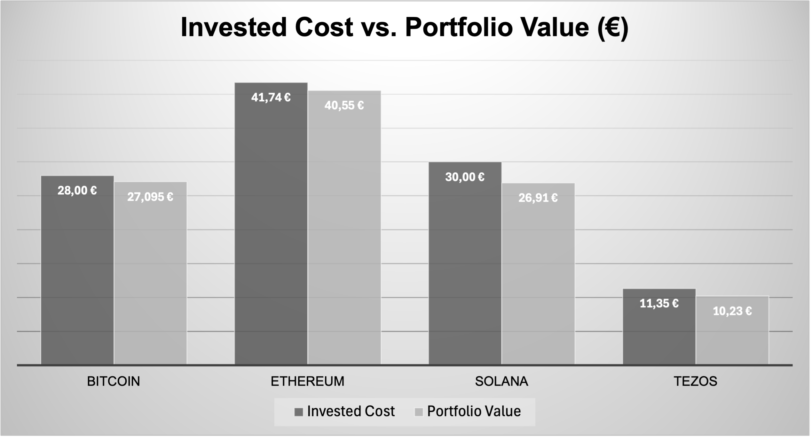

# Persönliches Finanz- und Lernprojekt – Mai 2025  
**Crypto · ETFs · Digitale Kunst · Datenanalyse**

## Ziel dieses Projekts

Dieses Projekt ist mein Einstieg in die Welt von Finanzen, Daten und digitaler Identität.  
Als Geisteswissenschaftler, queer und Ordensmann beginne ich nicht als Experte, sondern als Lernender mit dem Wunsch, zu verstehen, wie Geld, Investitionen und Datenanalysen wirklich funktionieren.

## Warum dieses Projekt?

Ich wollte nicht warten, bis ich perfekt vorbereitet bin. Ich habe mit kleinen Beträgen begonnen, um durch echtes Handeln zu lernen.

> Ich bin überzeugt: Lernen passiert durch Tun.

Anstatt ein abstraktes Data-Analytics-Projekt über fremde Unternehmensdaten zu machen, analysiere ich meine eigenen Daten:  
Investitionen, Wallets, Rewards, Kaufverhalten, Rückschlüsse aus realen Entwicklungen.

Ich finanziere dieses Projekt mit Geld, das ich vor über zehn Jahren bei meiner Ankunft in Deutschland von meiner Familie und engen Freund:innen als Geschenk erhalten habe. Dieses Geld blieb all die Jahre unberührt, weil ich in einem System lebte, in dem persönlicher Besitz nicht vorgesehen war. Heute nutze ich es bewusst für meinen Neuanfang, für meine Bildung und um meine Zukunft aktiv mitzugestalten.

## Inhalte

### 1. 1. [01_Crypto_Art_Portfolio_2025.xlsx](./01_Crypto_Art_Portfolio_2025.xlsx)
Komplettes Krypto-Portfolio:
- Coins: Bitcoin, Ethereum, Solana, Tezos
- Plattformen, Staking, Rewards
- NFT-Käufe mit Tezos

**Diagramme:**  
`01_Crypto_Allocation_Percentage.png`  
  

`01_Crypto_Invested_vs_Value.png`  

### 2. 2. [01_Investment_Plan_2025_Rebalancing.xlsx](./01_Investment_Plan_2025_Rebalancing.xlsx)
Fixer ETF- und Aktien-Plan (ab Juni 2025):
- ETFs: World, Robotics, Defense
- ETC: physisches Gold
- Einzelaktien: Rheinmetall, ASML
- Plattformen: Scalable Capital, Trade Republic

**Diagramme:**  
`01_ETF_Equity_Allocation_Current.png`  
  

`01_Fixed_Investment_Plan_June2025.png`  

`01_ETF_Invested_vs_TotalCost.png`  

`01_ETF_Investment_vs_CurrentValue.png`  

**Tabelle (Vorschau):**

### 3. Digitale Kunst & NFTs  
- Gekauft mit Tezos auf Objkt.com  
- Tabelle mit Kaufdatum, Kosten, Plattform, Wiederverkaufsoptionen  
- Gesamtausgaben werden mit dem Krypto-Portfolio zusammengeführt

## Persönlicher Hintergrund

Ich bin 37 Jahre alt, habe Geschichte und Kulturwissenschaften studiert und lebe in Berlin.  
Ich bin aktuell noch katholischer Ordensmann mit stabiler Absicherung, aber ohne finanzielle Eigenständigkeit.  
Themen wie Identität und Selbstbestimmung waren für mich immer zentral.  
Dieses Projekt ist für mich ein Schritt in Richtung Selbstverantwortung und Zukunftsaufbau.

## Über Krypto, Plattformen und Community

Ich habe mit Testkäufen begonnen. Coins wie DOT, SHIB und LTC waren Teil der Lernphase.  
Heute fokussiere ich mich auf:

**→ BTC, ETH, SOL, XTZ**

Diese Auswahl bietet mir:
- Klare Metriken und langfristige Relevanz
- Technische Unterschiede und vielfältige Anwendungsfelder
- Zugang zu Communities mit kreativer und dezentraler Energie

**Plattformen:**  
- Bitvavo (Auto-Staking)  
- Temple (Delegation via Bake)  
- Phantom (Delegated Stake via Solana Compass)  
- Ledger (zukünftig geplant)

NFTs sind für mich keine Spekulation, sondern Ausdruck von digitaler Identität, Kunst und Verbundenheit.

## Über das Lernen mit Geld

Ich hatte zu Beginn wenig Wissen über ETFs. Ich habe intuitiv gekauft, mehrfach angepasst, Gebühren gezahlt – und daraus gelernt.  
Heute verfolge ich einen fokussierten Plan mit bewusst gewählten Schwerpunkten:

- KI und Robotics  
- Rüstung & Geopolitik (Defense)  
- Weltmärkte & Nachhaltigkeit  

Ich lerne dabei, wie Gebühren wirken, was Rebalancing bedeutet und wie aus kleinen Summen ein strukturiertes System werden kann.

## Methoden & Tools

- Microsoft Excel: Formeln, Kategorien, automatische Auswertungen  
- GitHub: Dokumentation, Entwicklung  
- Podcast & Blog-Recherche  
- Unterstützung durch ChatGPT  
- Vergleichs- und Staking-Tools  

## Was dieses Projekt nicht ist

- Kein klassisches Investment-Portfolio zur Nachahmung  
- Keine Finanzberatung  
- Keine Selbstdarstellung von Erfolg oder Reichtum  

## Was es ist

Ein realer Datenraum zum Lernen.  
Ein persönliches Projekt über Geld, Verantwortung und digitale Selbstermächtigung.  
Ein Startpunkt.

Ich freue mich über Rückmeldungen, Austausch oder eigene Erfahrungen.
