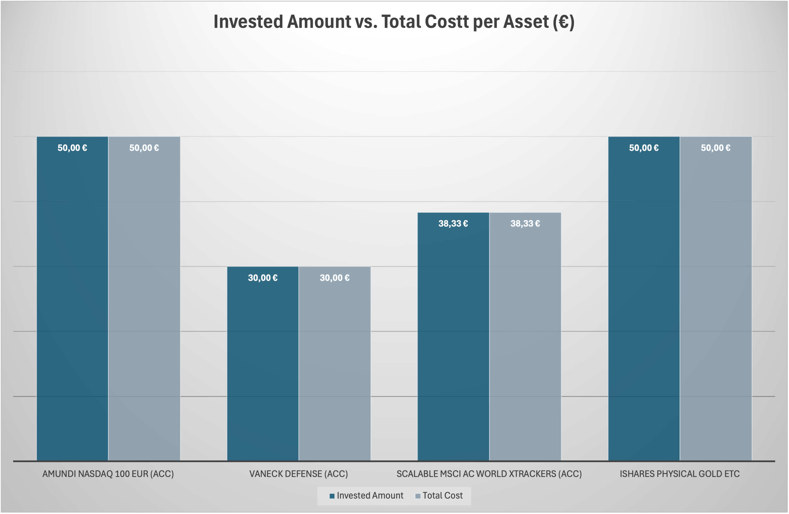

## Technical Project Overview – As of May 25, 2025

This section provides a structured summary of the project's data, tools, and visualizations. It is part of a self-directed financial learning project based on real investments and manual data tracking.

---

### Project Files and Content

#### 1. [01_Crypto_Art_Portfolio_2025.xlsx](./01_Crypto_Art_Portfolio_2025.xlsx)

**Contents:**
- Long-term coins: Bitcoin, Ethereum, Solana, Tezos  
- Rewards, staking platforms  
- Purchase history, NFT assets via Objkt.com  
- Aggregated summaries and tracking tabs

**Visualizations:**

  
*Asset distribution by coin*

  
*Invested amount compared to current value*

---

#### 2. [01_Investment_Plan_2025_Rebalancing.xlsx](./01_Investment_Plan_2025_Rebalancing.xlsx)

**Contents:**
- Fixed investment plan starting June 2025  
- ETFs (e.g. World, Robotics, Defense)  
- Physical gold ETC  
- Stocks (e.g. Rheinmetall, ASML)  
- Platforms: Scalable Capital, Trade Republic

**Investment Table (extract):**

**Visualizations:**

  
*Current ETF distribution by category*

  
*Target allocation after rebalancing (starting June 2025)*

  
*Planned vs. actual investment per asset*

  
*Current market value vs. invested total*

---

###  Tools and Methods

**Microsoft Excel**  
Used for structured tracking, automated calculations, and clean visualizations:
- Calculations (e.g. Invested vs. Value)
- Monthly performance tracking (time series)
- Consistent visual formatting (neutral color scheme)

**GitHub**  
Used for documentation and tracking project progress.

**Manual Data Collection**  
All data is manually extracted from:
- Bitvavo, Scalable Capital, Trade Republic
- Wallets, prices, staking rewards, IDs

**Reflection & Learning Tools**  
- Financial podcasts, blogs, courses
- AI-powered assistance (e.g. ChatGPT)

---

### Future Development Plans

- Time series analysis (monthly updates on value and allocation)  
- Visualization with Power BI or Python (pandas, matplotlib)  
- Analysis of rebalancing effects (starting July 2025)  
- Dashboard creation (KPI tracking, visual summaries)

---

### Objective

This is not a professional data analytics solution but a transparent, real-life learning project.  
It combines real investment behavior with methodical observation, charting, and structured reflection.

*Real values, real risks, real progress.*
