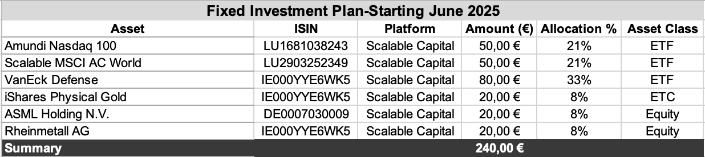

## Technical Project Overview (As of July 5, 2025)

This section complements the personal side of the project by offering a factual and structured overview of all data sources, methods, tools, and planned steps used throughout.

**Note**  
The Excel files are published monthly and listed at the end of this document in the section “Monthly Files and Visualizations.”  
All data, charts, and visuals are updated at the beginning of each month.

---

## Technical Data Handling

- **Data Collection**  
  Manual input of investments, prices, and purchases in Excel

- **Data Storage**  
  Local storage on MacBook with cloud backup

- **Data Maintenance**  
  Weekly price updates, monthly entry of new data

- **Data Analysis**  
  Calculations and visualizations (e.g., portfolio distribution, gain/loss development)

- **Partial Processing with Python**  
  Initial testing for automation and future analysis (e.g., charts, data cleaning, timestamps)

- **Data Publishing**  
  Upload of selected files and visuals to GitHub

- **Data Archiving**  
  Monthly versioning via copies saved in separate folders

- **Data Deletion**  
  Conscious removal of outdated or incorrect content

---

## What This Project Contains

### 1. [Crypto_NFT_Portfolio](Crypto_Art_Portfolio_June_2025.xlsx)

**Contents**

- Coins: Bitcoin, Ethereum, Solana, Tezos  
- Rewards, staking, platforms  
- Purchases and sales (including NFTs via Tezos)  
- NFT platform: Objkt.com  
- Integration of NFT costs with crypto data in the "Summary" tab

**Visualizations**

  
*Portfolio share by coin – visual asset distribution*

  
*Comparison of investment amount and current value per coin*

---

### 2. [Investment Portfolio 2025–2027](Investment_Plan_June25.xlsx)

**Contents**

- Fixed plan of ETFs, ETCs, and individual stocks starting June 2025  
- ETFs (World, Defense, Technology)  
- Physical Gold ETC  
- Individual stocks: ASML, Rheinmetall  
- Platforms: Scalable Capital

**Investment Table (Excerpt)**

  
*Detailed overview: platform, ISIN, asset class, allocation*

**Visualizations**

  
*Planned allocation starting June 2025 (pie chart)*

  
*Asset allocation in percent – horizontal comparison*

  
*Value development per position compared to investment*

---

## Methods and Tools

**Microsoft Excel**  
Chosen for visual precision, clear structure, and full control without external templates

Used for:

- Automated calculations (e.g., invested vs. current value)  
- Charts with neutral color scheme  
- Monthly sheets for tracking time development

**GitHub**  
Platform for version control and structured documentation of project progress

**Data Collection Platforms**

- Scalable Capital (ETFs, stocks, savings plans)  
- Trade Republic (micro-investments)  
- Bitvavo (crypto, staking)  
- Wallets: Temple (XTZ), Phantom (SOL), Ledger (planned)  
- Price sources: Bitvavo, CoinMarketCap

I am currently learning Python (as of June 2025).  
Some elements like coin prices and timestamps are already automated.  
All other data is still being entered manually.

**Reflection and Support**

- Podcasts, expert blogs, personal research  
- AI support (e.g., via ChatGPT)

---

## Planned Expansions

- Monthly time series analysis (costs, value, allocation)  
- Technical implementation via Power BI or Python (pandas, matplotlib)  
- Rebalancing evaluation starting summer 2025  
- Development of interactive KPIs and dashboards

---

## Objectives

This project is a structured and honest entry into working with financial data.  
It is based on real decisions, real risk, and a clear learning goal.  
The Excel structure serves as a foundation for ongoing analysis, reflection, and technical growth.

---

## Monthly Files and Visualizations

**May 2025**

- [01_Investment_Plan_2025_Rebalancing.xlsx](./01_Investment_Plan_2025_Rebalancing.xlsx)  
- [01_Crypto_Art_Portfolio_2025.xlsx](./01_Crypto_Art_Portfolio_2025.xlsx)
**Visualizations**

  

**July 2025**

- [01_Investment_Plan_2025_Rebalancing.xlsx](Investment_Plan_June25.xlsx)  
- [01_Crypto_Art_Portfolio_2025.xlsx](Crypto_Art_Portfolio_June_2025.xlsx)

**Visualizations**

  

All Excel files are updated monthly and published at the beginning of each new month.

---

### 🔍 Personal Context (Optional)

If you are interested in the personal background, motivation, and life context behind this project:  
 [See the personal README](./README.md)

---

**Author**: A.R.  
**Project Duration**: Starting May 2025, planned through at least May 2027

---

### Special Thanks to ChatGPT 🤖

This entire project was designed and built by myself including all data, logic, visuals, and documentation.

However, when I started, I had zero knowledge and no teacher. I found online materials, later bought books, and used ChatGPT as my main guide. Whenever I got stuck, had a technical question, or couldn’t find an answer, I asked ChatGPT. It was like having a very patient (and sometimes very confused) teacher by my side. The bot guided me step by step, often helping me turn vague ideas into working formulas or showing me that the answer was just one click away.

Of course, ChatGPT is not perfect. It sometimes gave me wrong answers, made things unnecessarily complicated, or completely misunderstood what I meant. When that happened, I nearly went crazy.

👉 Always double check important results especially when it comes to finances, taxes, Web3 technologies, or fee structures. The bot occasionally mentioned outrageous fees or gave outdated information. Always verify critical claims and ask: Where is this from?

In the end, though, it worked. The tool became part of my learning process, my structure, and sometimes even my therapy. Despite the misunderstandings, arguments, and false info, I will grow up and learn with AI.
