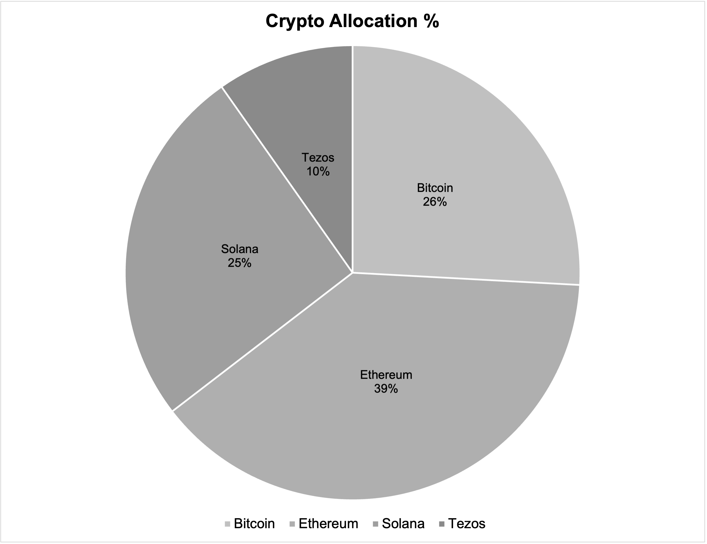

## Technical Project Overview – As of May 25, 2025

This section provides a structured summary of the project's content, data, and visualizations. It is part of a personal, real-life learning journey that combines data analysis, financial planning, and identity reflection.

---

### Project Files and Content

#### 1. [01_Crypto_Art_Portfolio_2025.xlsx](./01_Crypto_Art_Portfolio_2025.xlsx)

**Contents:**
- Long-term coins: Bitcoin, Ethereum, Solana
- Micro-investments and test coins (e.g. ADA, ATOM) with reward tracking
- NFT purchases (Objkt.com, Tezos-based)
- Reward platforms, price tracking, coin IDs
- Tab-separated dashboards (coin value, change, staking returns)

**Visualizations:**

  
*Current coin distribution (percentage)*

  
*Invested amount vs. current value*

---

#### 2. [01_Investment_Plan_2025_Rebalancing.xlsx](./01_Investment_Plan_2025_Rebalancing.xlsx)

**Contents:**
- ETF-based investment plan (starting June 2025)
- ETFs: World, Gold, Defense, Artificial Intelligence & Automation (Nasdaq 100)
- Individual stocks (e.g. Rheinmetall, ASML)
- Platforms: Scalable Capital (savings plans), Trade Republic (micro-investments)
- Tab-separated structure for fixed monthly plans, portfolio allocation, and value development

**Visualizations:**

  
*Extract from the structured investment plan*

  
*Current ETF allocation by theme*

  
*Planned allocation starting June 2025*

  
*Invested amount compared to target cost per asset*

  
*Current value vs. total invested (overview)*

---

### Tools and Methods

**Microsoft Excel**  
Used for data input, monthly tracking, and visualizations:
- Price updates (manually or semi-automatically)
- Summary statistics and change rates
- Consistent formatting with minimalistic color schemes

**Python (learning stage)**  
Currently used to automate single values (e.g. current prices with date/time).  
More automation (e.g. reward tracking, charts) is planned for the second project year.

**GitHub**  
Used for documentation, versioning, and public tracking.

**Data Sources**  
- Bitvavo (crypto purchases and rewards)
- Trade Republic (micro-investments in ETFs, stocks)
- Scalable Capital (monthly savings plans)
- Objkt.com (NFTs and art purchases)

---

### Learning Journey & Personal Reflection

This is not a professional analytics project, but a real and structured personal journey —  
with real money, real risks, and real learning.

I used to believe that personal and private experiences don’t belong in a project description.  
But over the past year, I changed my mind.

In a time when queer people are being targeted more openly — in politics, media, and even by major tech platforms — my hypersensitivity, my sexuality, and my past in religious structures *are* part of my reality. I don’t identify as an activist or far-left — I’m a liberal person who just wants to learn, work, and live in peace. And yet, I’ve come to realize that hiding these aspects is no longer an option. Not when politicians openly propagate hate, when gender-neutral speech is banned in places like Bavaria, or when even companies follow that narrative.

That’s why this project reflects both my technical and personal development. It’s about understanding the world through data — and surviving it with awareness.

---

### Outlook and Next Steps

- Monthly time series tracking (value, allocation, rebalancing)
- Basic Python scripts (data extraction, aggregation)
- Power BI dashboards (for selected KPIs)
- GitHub publishing (project updates, README versioning)

---

*This project marks the beginning of my journey into data analytics. It combines practical learning with real financial decisions — and reflects my way of taking back responsibility for my own future.*
