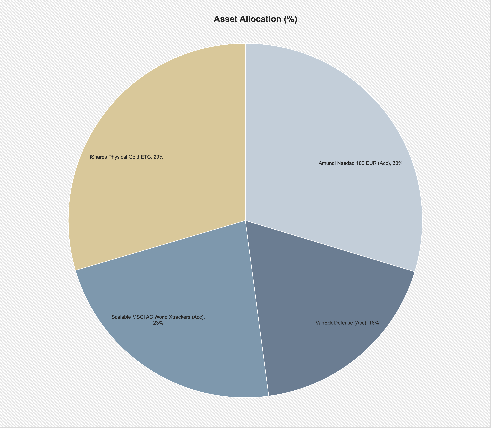
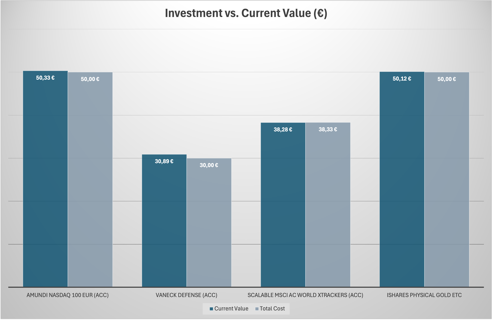

## Technical Project Overview – As of May 25, 2025
*Last updated: June 2, 2025*

This section provides a structured summary of the project's content, data, and visualizations. It is part of a personal, real-life learning journey that combines data analysis, financial planning, and identity reflection.

---

### Project Files and Content

#### 1. [01_Crypto_Art_Portfolio_2025.xlsx](./01_Crypto_Art_Portfolio_2025.xlsx)

**Contents:**
- Long-term coins: Bitcoin, Ethereum, Solana
- Micro-investments and test coins (e.g. ADA, ATOM) with reward tracking
- NFT purchases (Objkt.com, Tezos-based)
- Reward platforms, price tracking, coin IDs
- Tab-separated dashboards (coin value, change, staking returns)

**Visualizations:**

  
*Current coin distribution (percentage)*

  
*Invested amount vs. current value*

---

#### 2. [01_Investment_Plan_2025_Rebalancing.xlsx](./01_Investment_Plan_2025_Rebalancing.xlsx)

**Contents:**
- ETF-based investment plan (starting June 2025)
- ETFs: World, Gold, Defense, Artificial Intelligence & Automation (Nasdaq 100)
- Individual stocks (e.g. Rheinmetall, ASML)
- Platforms: Scalable Capital (savings plans), Trade Republic (micro-investments)
- Tab-separated structure for fixed monthly plans, portfolio allocation, and value development

**Visualizations:**

  
*Extract from the structured investment plan*

  
*Planned allocation starting June 2025*

  
*Current ETF allocation by theme*

  
*Invested amount compared to target cost per asset*

  
*Current value vs. total invested (overview)*

---

### Tools and Methods

**Microsoft Excel**  
Used for data input, monthly tracking, and visualizations:
- Price updates (manually or semi-automatically)
- Summary statistics and change rates
- Consistent formatting with minimalistic color schemes

**Python (learning stage)**  
Currently used to automate single values (e.g. current prices with date/time).  
More automation (e.g. reward tracking, charts) is planned for the second project year.

**GitHub**  
Used for documentation, versioning, and public tracking.

**Data Sources**  
- Bitvavo (crypto purchases and rewards)
- Trade Republic (micro-investments in ETFs, stocks)
- Scalable Capital (monthly savings plans)
- Objkt.com (NFTs and art purchases)

---
---

### Personal Note

This is not only a technical project. It also reflects my path of building a self-determined and sustainable life — financially, professionally, and personally.

I used to believe that private matters had no place in a professional setting. But I changed my mind. In times when gender-neutral language is banned in some German states, when radical politicians attack queer communities, and when major tech companies support those ideologies, I believe that transparency is important.

I am not an activist, and I don’t identify as “left-wing” — but I do consider myself a liberal person. And as such, I feel responsible not to stay silent. My hypersensitivity, my queerness, and my past are part of who I am — and they belong here, too.

This project is one small attempt to make data personal — not to prove anything, but to stay visible.

---

### Outlook and Next Steps

- Monthly time series tracking (value, allocation, rebalancing)
- Basic Python scripts (data extraction, aggregation)
- Power BI dashboards (for selected KPIs)
- GitHub publishing (project updates, README versioning)

---

*This project marks the beginning of my journey into data analytics. It combines practical learning with real financial decisions — and reflects my way of taking back responsibility for my own future.*
