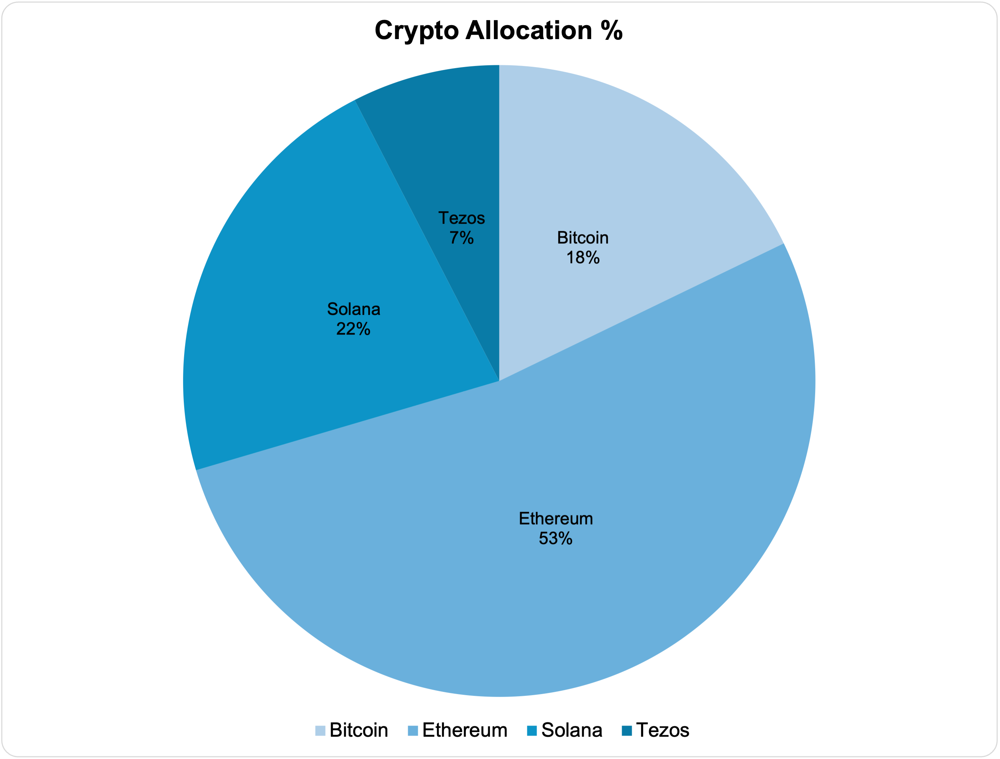
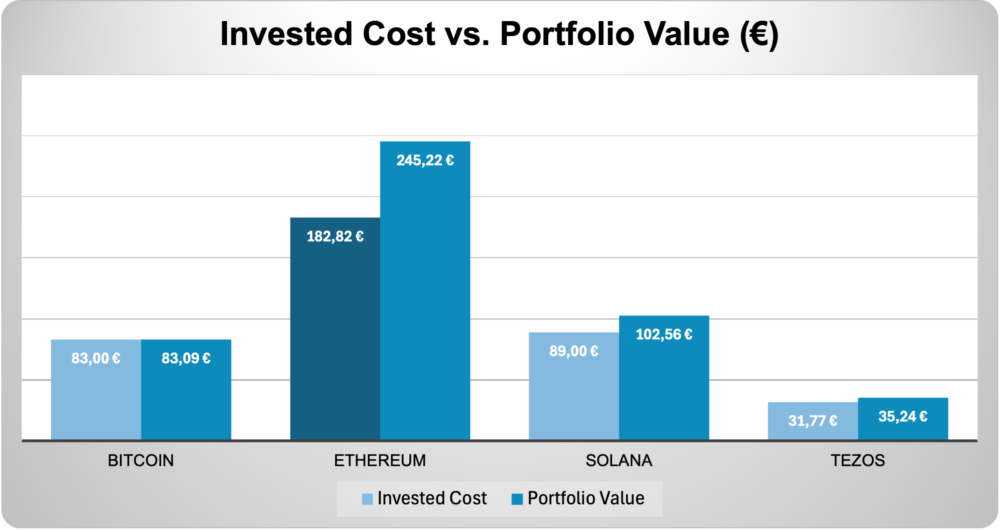
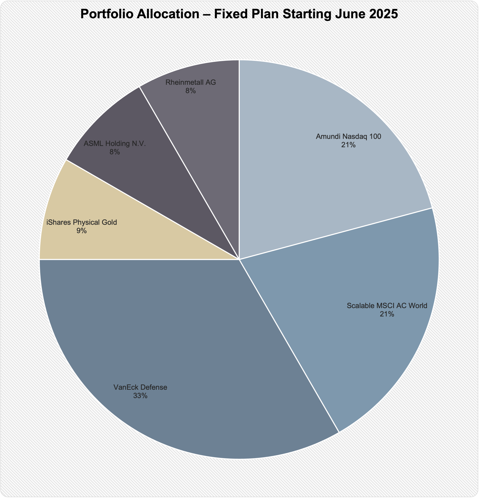
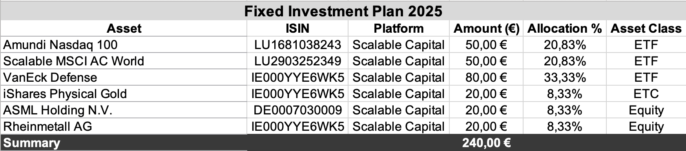
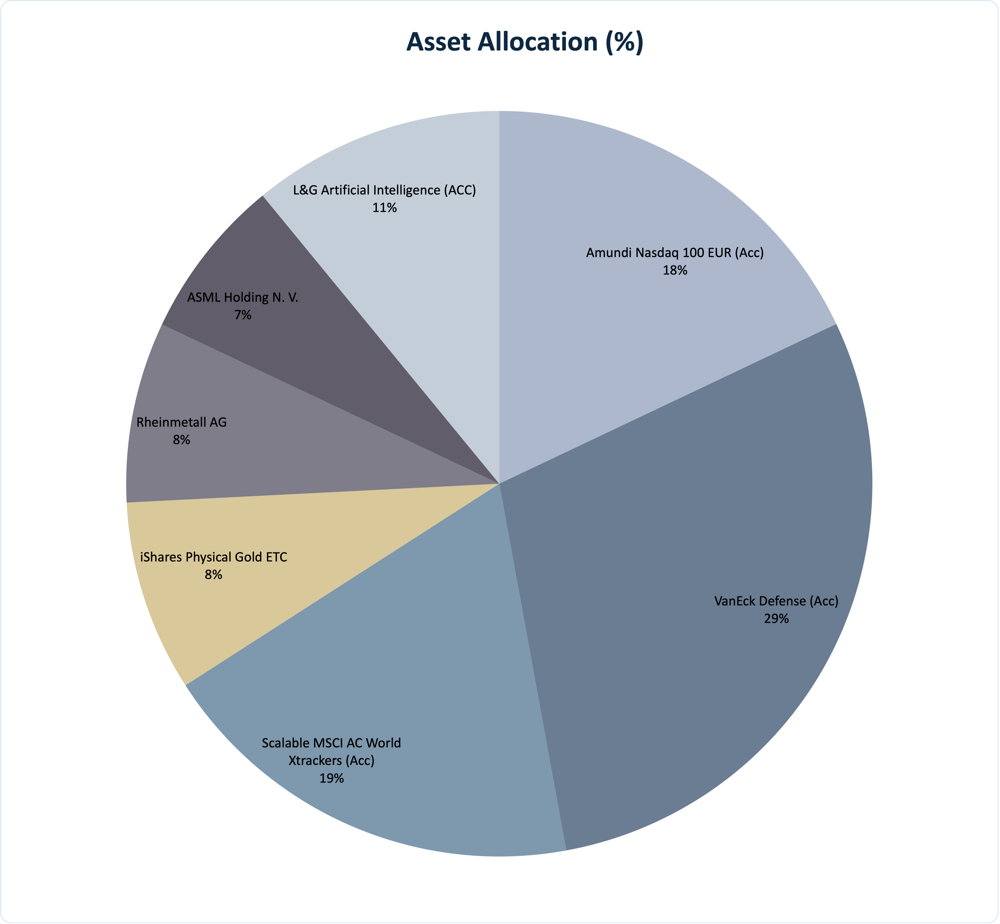
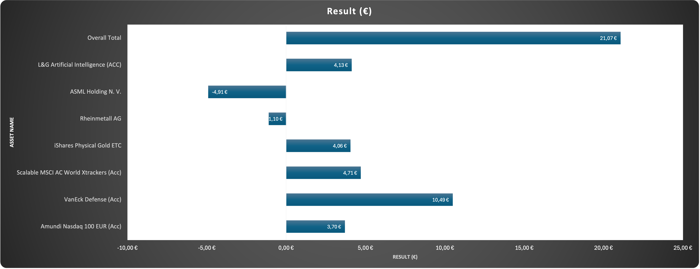

# Technischer Projektüberblick (Stand: 2. September 2025)

Dieser Abschnitt ergänzt den persönlichen Teil des Projekts um eine sachliche und strukturierte Übersicht aller verwendeten Datenquellen, Methoden, Tools und geplanten Schritte.

**Hinweis**  
Die Excel-Dateien werden monatlich veröffentlicht und befinden sich am Ende dieser Datei im Abschnitt „Monatliche Dateien und Visualisierungen“.  
Alle Daten, Diagramme und Visualisierungen werden jeweils zu Beginn eines Monats aktualisiert.

---

## Technischer Umgang mit Daten

- **Datenerfassung**  
  Manuelle Eingabe von Investitionen, Preisen und Käufen in Excel  

- **Datenspeicherung**  
  Lokale Speicherung auf dem MacBook mit Cloud-Backup  

- **Datenpflege**  
  Wöchentliche Preisaktualisierung, monatliche Ergänzung von neuen Einträgen  

- **Datenanalyse**  
  Berechnungen und Visualisierungen (z. B. Portfolioverteilung, Entwicklung von Gewinnen und Verlusten)  

- **Teilweise Verarbeitung mit Python**  
  Erste Tests zur Automatisierung und späteren Analyse (z. B. Diagramme, Datenbereinigung, Zeitstempel).  
  Aktuell liegen dafür **zwei Python-Skripte** vor:  
  - [Investment.py](Investment.py)  
  - [Coins,2025.py](Coins,2025.py)  

- **Datenveröffentlichung**  
  GitHub Upload ausgewählter Dateien und Diagramme  

- **Datenarchivierung**  
  Monatliche Versionierung durch Dateikopien in separaten Ordnern  

- **Datenlöschung**  
  Entfernen veralteter oder fehlerhafter Inhalte mit bewusster Auswahl

---

## Was enthält dieses Projekt?

### 1. [Crypto & NFT Portfolio](Crypto_Portfolio_September_2025.xlsx)

**Inhalte**

- Coins: Bitcoin, Ethereum, Solana, Tezos  
- Rewards, Staking, Plattformen  
- Käufe und Verkäufe (inkl. NFTs mit Tezos)  
- NFT Plattform: Objkt.com  
- Zusammenführung von NFT Kosten mit Krypto-Daten im Summary  

**Visualisierungen**

  
*Portfolioanteile nach Coin – visuelle Verteilung der Assets*

  
*Vergleich der Investitionssumme und aktuellen Werte je Coin*

---

### 2. Investment Plan

**Inhalte**

- Fixer ETF, ETC und Aktienplan mit Start im Juni 2025  
- ETFs (World, Defense, Technologie)  
- Physisches Gold ETC  
- Einzelaktien: ASML, Rheinmetall  
- Plattformen: Scalable Capital  

**Investmenttabelle (Auszug)**

*Detailübersicht: Plattform, ISIN, Anlageklasse, Verteilung*  

**[Aktueller Portfoliostand – 2. September 2025](Investment_Plan_September_2025.xlsx)**

**Visualisierungen**

  

  

*Wertentwicklung pro Position im Vergleich zur Investition*

---

## Methoden und Tools

**Microsoft Excel**  
Gewählt wegen visueller Präzision, klarer Struktur und vollständiger Kontrolle ohne externe Vorlagen.

Verwendet wurden:

- Automatisierte Berechnungen (z. B. investiert versus aktueller Wert)  
- Diagramme mit sachlicher Farbwahl  
- Monatsregister zur Beobachtung von Zeitverläufen  

**GitHub**  
Plattform zur Versionierung und strukturierten Dokumentation des Projektfortschritts.

**Plattformen zur Datenerhebung**

- Scalable Capital (ETFs, Aktien, Sparpläne)  
- Bitvavo (Krypto, Staking)  
- Wallets: Temple (XTZ), Phantom (SOL), Ledger (geplant)  
- Preisquellen: Bitvavo, CoinMarketCap  

Ich lerne aktuell Python (Stand: Juni 2025).  
Einige Elemente wie Coinpreise und Zeitstempel werden bereits automatisiert erhoben.  
Alle weiteren Daten werden derzeit noch manuell dokumentiert.  

**Reflexion und Begleitung**

- Podcasts, Fachblogs, persönliche Recherche  
- KI Unterstützung (z. B. ChatGPT)

---

## Geplante Erweiterungen

- Monatliche Zeitreihenanalyse (Kosten, Wert, Allokation)  
- Technische Umsetzung mit Power BI oder Python (`pandas`, `matplotlib`)  
- Rebalancing Auswertung ab Sommer 2025  
- Aufbau interaktiver KPIs und Dashboards

---

## Zielsetzung

Dieses Projekt ist ein strukturierter, ehrlicher Einstieg in Finanzdaten.  
Es basiert auf echten Entscheidungen, realem Risiko und klarem Lernziel.  
Die Excel-Struktur dient als Grundlage für kontinuierliche Analyse, Reflexion und technisches Wachstum.

---

## Monatliche Dateien und Visualisierungen

**Mai 2025**

- [nvestment Plan_Mai 2025](./01_Investment_Plan_2025_Rebalancing.xlsx)  
- [Crypto Portfolio_Mai 2025](./01_Crypto_Art_Portfolio_2025.xlsx)  

**Juni 2025**

- [Investment_Plan_Juni 2025_Rebalancing.xlsx](Investment_Plan_June25.xlsx)  
- [Crypto Portfolio_Juni 2025.xlsx](Crypto_Art_Portfolio_June_2025.xlsx)  

**August 2025**

- [Investment Plan August 2025](Investment_Plan_September_2025.xlsx)
- [Crypto Portfolio August 2025](Crypto_Portfolio_September_2025.xlsx)

---

### 🔍 Hinweis für Interessierte an persönlichen Hintergründen

Weitere Informationen zu Motivation, Lebenssituation, Erfahrungen und persönlichen Beweggründen befinden sich im separaten Bereich dieses Projekts:  
👉 [Zur persönlichen README](./README.md)

---

**Autor**: A.R.  
**Projektzeitraum**: Start Mai 2025, geplant bis mindestens Mai 2027

---

## Besonderer Dank an ChatGPT 🤖

Dieses gesamte Projekt wurde von mir selbst entworfen und umgesetzt. Dazu gehören alle Daten, die Logik, die Visualisierungen und die Dokumentation.

Als ich anfing, hatte ich keinerlei Vorwissen und keine Lehrkraft. Ich habe mir selbst Online-Materialien gesucht, später Bücher gekauft und ChatGPT als meinen wichtigsten Begleiter genutzt. Immer wenn ich nicht weiterkam, technische Fragen hatte oder keine Lösung fand, habe ich den Bot gefragt. Es war wie ein sehr geduldiger Lehrer an meiner Seite, der manchmal auch ziemlich verwirrt war. Der Bot hat mich Schritt für Schritt begleitet, oft geholfen, vage Ideen in funktionierende Formeln zu verwandeln oder mir gezeigt, dass die Lösung nur einen Klick entfernt war.

Natürlich ist ChatGPT nicht perfekt. Manchmal gab es falsche Antworten, unnötig komplizierte Erklärungen oder Missverständnisse. Und ja, manchmal bin ich daran fast verzweifelt.

👉 Deshalb gilt: Wichtige Ergebnisse immer doppelt prüfen. Besonders bei Finanzen, Steuern, Web3 oder Gebührenangaben. Der Bot hat gelegentlich absurde Gebühren genannt oder veraltete Informationen geliefert. Kritische Aussagen immer hinterfragen: *Woher kommt das?*

Aber am Ende hat es funktioniert. Das Tool wurde ein Teil meines Lernprozesses, meiner Struktur und manchmal sogar meiner Therapie. Trotz Missverständnissen, Diskussionen und falscher Infos:  
**Ich werde mit KI aufwachsen und weiterlernen.**
